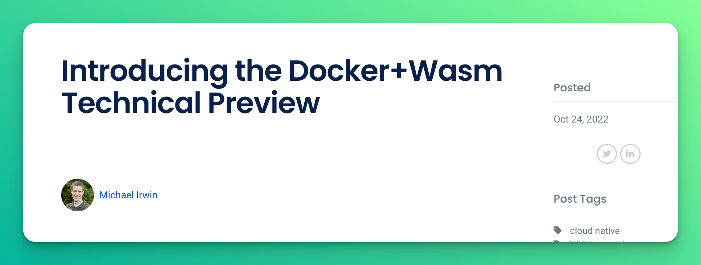

# Cloud Native 2.0

## Long time, no speak!

---

# Who Am I?

## David Flanagan

- Founder Rawkode Academy
- Formerly Pulumi, Equinix Metal (Packet), InfluxDB, & more.

- <carbon-logo-twitter /> rawkode
- <carbon-logo-github /> rawkode
- <carbon-logo-youtube /> @RawkodeAcademy
- <carbon-logo-discord /> https://rawkode.chat

---
layout: section
transition: slide-up
---

# What is Cloud Native?

---
transition: slide-up
---

# What is Cloud Native?

Screenshot from the Wayback Machine, Sept 2017

The CNCF used to define Cloud Native as:

---
transition: slide-up
---

# What is Cloud Native?

This changed.

It was redefined, in the open, by members of the early Cloud Native community.

> Cloud native technologies empower organizations to build and run scalable applications in modern, dynamic environments such as public, private, and hybrid clouds. Containers, service meshes, microservices, immutable infrastructure, and declarative APIs exemplify this approach.

> These techniques enable loosely coupled systems that are resilient, manageable, and observable. Combined with robust automation, they allow engineers to make high-impact changes frequently and predictably with minimal toil.

> The Cloud Native Computing Foundation seeks to drive adoption of this paradigm by fostering and sustaining an ecosystem of open source, vendor-neutral projects. We democratize state-of-the-art patterns to make these innovations accessible for everyone.

---
transition: slide-up
---

# What is Cloud Native?

Why this changed?

## The CNCF scope was changing

It adopted it's first 15 projects within the first 2 years.

It wasn't merely a home for Kubernetes and Prometheus, but for OpenTracing, Fluentd, Linkerd, gRPC, CoreDNS, containerd, rkt, CNI, Envoy, Notary, TUF, with Rook being project 15 (2018).

---

# What is Cloud Native?

Why this changed?

## New Patterns

- Serverless Adoption Goes 🚀
- Docker purchases Unikernel Systems (2016)
- Event-Driven / Workflow based (Cadence) gains momentum (2017)
- WebAssembly was born (2017)

---
layout: section
transition: slide-up
---

# WebAssembly

---
transition: slide-up
---

# WebAssembly

Solomon is less bull-ish these days

<Tweet id="1111004913222324225" />

---
transition: slide-up
---

# Why WebAssembly?

Truly portable code

- Language Agnostic
- Host Agnostic
- Architecture Agnostic

---
layout: two-cols
transition: slide-up
---

# Language Agnostic

- C / C++
- Go (🎉 1.21)
- Rust

- dotNet
- JavaScript / TypeScript
- Python
- Ruby

- Java / Kotlin
- Perl
- PHP

::right::

- Dart
- Nim
- Swift
- Zig

- Haskell
- Julia
- Lisp
- Lua

- Brainfuck
- Elixir / Erlang
- Crystal

---
transition: slide-up
---

# Language Agnostic

Not Just Agnostic, but Primitive

## Grain

https://grain-lang.org

---
transition: slide-up
---

# Host Agnostic

Any OS, but notable ...

- BSD
- Linux
- macOS
- Windows

---
transition: slide-up
---

# Host Agnostic

Not Just Agnostic, but Primitive

## Kwast

https://github.com/kwast-os/kwast

---

# Architecture Agnostic

Who's using Docker on an M1/2 Apple computer?

- AMD64
- Arm64

---
layout: section
---

# Change is Needed

---

# Change is Needed

Containers are great, except when they're not

- OS Portability
- Architecture / Multi Platform / Manifests
- macOS File Sharing for Interpreted Languages
- Cold Start Times
- Virtualization / Distribution / Size (GBs!?)
- Process Limits / Resource Utilization / Pause Containers
- "Sandbox"

---
layout: section
---

# WebAssembly

## Can Help

---
layout: section
---

# Build Once, Run Anywhere

---
layout: section
transition: slide-up
---

# Where Are We Now?

---
transition: slide-up
---

# CNCF Landscape

2 Sandbox Projects, 1 Graduated Usage, 1 Defunkt Idea

- Envoy 💖 WASM
- Krustlet 🥲
- wasmcloud & WasmEdge

---
transition: slide-up
---

# Outside CNCF

Some Pretty Big Deals

- Cloudflare Workers
- Cosmonic
- Spin
- Suboribtal / Atmo
- wapc

---
layout: fact
---

# Docker Isn't Ignoring This

---

# Docker Isn't Ignoring This

---

# Docker Isn't Ignoring This

- Docker Desktop can run WASM with 4 major runtimes:
  - slight
  - spin
  - wasmedge
  - wasmtime

- Distribution / Registry Support

- docker compose

---
layout: section
---

# Cloud Native 2.0

## 🚀 Containers & WebAssembly 🌚

### 🦸🏻‍♀️

---
layout: fact
---

# runwasi

---

# runwasi

Native wasm for containerd

- Supported by Docker, Fermyon, Microsoft, and others
- KWasm to bootstrap

---
layout: section
---

# Let's Spin

---

# Let's Spin

I can't show you all the WASM runtimes

Spin, from Fermyon, is leading the charge with:

- DX focused
- Feature complete (KV, Triggers, Cloud Hosting)
- SDK support (Rust, NodeJS, Python, Go, dotNet)

---

# Demo

Wish me luck!

## Remind me to:

- Build a Spin app
- Push to GHCR
- Deploy KWasm
- Deploy to Kubernetes
- Multi Component 🤯

---
layout: fact
---

# The Future is Exciting

---
layout: section
---

# Thank You

## 💖

### 🙋🏻 Questions?
