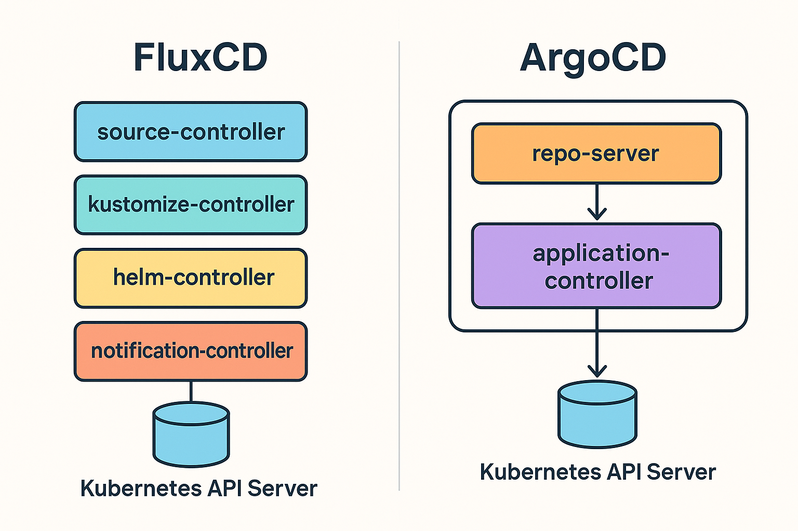

import Aside from '@/components/Aside.astro';

<Aside variant="info">
This article is an opinion piece based on the author's experience. We encourage readers to explore multiple perspectives and form their own informed opinions.
</Aside>

**The Flux Advantage in 60 Seconds:**
* **Architecture:** Flux is a set of discrete, single-purpose controllers that mirror Kubernetes' own design. Argo is a monolithic bundle of inter-dependent services.
* **Operations:** Flux provides structural failure isolation and precise, per-component scaling. Argo's bundled design creates systemic failure modes and complex scaling logic.
* **Security:** Flux’s compartmentalized controllers create a minimal, defensible attack surface. Argo's monolithic `repo-server` is a well-documented source of critical, system-wide CVEs.
* **Extensibility:** Flux extends via composable, independent controllers. Argo relies on plugins that create tight operational coupling with its core `repo-server` process.

---

FluxCD and ArgoCD both promise Git-driven, declarative delivery, but only one of them **embraces the DNA of Kubernetes instead of merely co-existing with it**. Flux's architecture, composed of single-purpose controllers, is a natural extension of the platform it runs on. If you prioritize operational clarity, security, and long-term cost of ownership, Flux isn't just another option - it's the inevitable choice.

### Let's Be Honest: The Appeal of ArgoCD is Real

ArgoCD's popularity isn't an accident. Its all-in-one installation and polished, built-in user interface provide an outstanding out-of-the-box experience. For teams adopting GitOps for the first time, the `Application` CRD and the web UI offer a shallow learning curve and immediate visual feedback.

These are significant advantages. However, this initial convenience comes with long-term architectural and operational costs - trade-offs that are often overlooked until a team is operating at scale, where they become impossible to ignore.

### Architectural Alignment: The Picture Is Clear

Kubernetes succeeds because every task - scheduling, autoscaling, networking - is handled by a dedicated, single-purpose controller. Flux extends this contract seamlessly.

| Flux Controller     | Purpose                                       |
| ------------------- | --------------------------------------------- |
| **Source** | Fetches Git/Helm/OCI artifacts                |
| **Kustomize** | Reconciles Kustomizations                     |
| **Helm** | Manages `HelmRelease` objects declaratively     |
| **Notification** | Routes events to Slack, Teams, and webhooks   |
| **Image Automation**| Automatically updates image tags in Git       |

Each controller is its own Deployment, upgraded, scaled, and RBAC-scoped in isolation. This gives operators surgical precision. ArgoCD, by contrast, bundles its core logic into three main inter-dependent services - `repo-server`, `application-controller`, and `argocd-server` - and often relies on optional Redis and Dex components to handle caching and auth.

***Visualizing the Difference***

The diagram below illustrates the core architectural divide. On one side, Flux's controllers operate as independent agents, each with a direct line to the Kubernetes API. On the other, Argo's core services are bundled, interacting internally before presenting a unified front to the API.

This distinction isn't merely academic; it's the root cause of the operational differences that follow.

### Day-Two Operations: Precision Beats "One Size Scales All"

- **Resource Footprint:** Flux maintainers state that controllers use **~30 MiB of RAM each** after bootstrap, though actual usage can vary based on workload. In contrast, ArgoCD's documentation shows default resource requests of **256Mi for the** `repo-server` **and 1Gi for the** `application-controller` - before accounting for Redis. While these are defaults that can be tuned, the architectural difference is clear.

- **Failure Isolation:** If Flux's `helm-controller` crashes, your Git and Kustomize reconciliations continue to flow. If Argo's `repo-server` experiences a failure, it can stall manifest rendering for *every single application* simultaneously.

- **Scaling:** Need to handle more Helm repositories? Simply increase the `replicas` for Flux's `source-controller`. In ArgoCD, scaling often requires enabling and configuring more complex controller sharding logic, managed via environment variables and replica count adjustments.

### Security Posture: Smaller Binaries, Smaller Blast Radius

Both Flux and ArgoCD achieved **CNCF Graduation in late 2022**, demonstrating their security, governance, and stability. Flux graduated on November 30, 2022, with ArgoCD following shortly after in December 2022.

Flux's decomposed architecture means each binary has a limited scope and a smaller attack surface. Meanwhile, Argo's `repo-server` has experienced several vulnerabilities. For example, **CVE-2024-29893** allowed a malicious Helm registry to trigger a Denial-of-Service by causing the repo-server to run out of memory during unbounded data fetching. When a single component is responsible for fetching and rendering untrusted multi-tenant resources, its broad scope increases the potential blast radius.

### Extensibility: Rendering Philosophies Reveal Design Principles

Flux's approach to configuration languages is straightforward: each gets its own dedicated controller. Need KCL support? Deploy the kcl-controller. Want CUE? Add the cue-controller. These controllers operate independently, following the same patterns as every other Flux component.
ArgoCD takes a different path. While it can leverage the same operators Flux uses (like External Secrets Operator), its approach to configuration rendering reveals its monolithic nature. Support for languages like KCL or CUE requires either:

Config Management Plugins (CMPs) - Scripts that run inside the repo-server, inheriting its permissions and failure modes
Sidecar containers - Additional processes coupled to the repo-server's lifecycle

This isn't just an implementation detail. When your KCL rendering logic crashes in a CMP, it can affect the repo-server's ability to process other applications. When a Flux kcl-controller crashes, your Helm and Kustomize deployments continue unaffected.
The architectural divide is clear: Flux extends through composition of independent controllers, while ArgoCD extends through augmentation of its central rendering service. One scales horizontally with clear failure boundaries; the other scales vertically with shared failure modes.

Of course, the elephant in the room is that KCL and CUE controllers may not exist yet. But the point is that Flux's architecture allows for their creation without introducing new monolithic components. This is a design principle that aligns with Kubernetes' own extensibility philosophy.

### But What About ApplicationSets?

ArgoCD's `ApplicationSet` controller is an elegant solution for managing applications across a fleet of clusters. It is, deservedly, a killer feature.

Flux achieves the same outcome, albeit in a more Kubernetes-native way, by composing its existing APIs. Using a combination of the **Flux `Provider` for Terraform** or by templating `Kustomization` and `HelmRelease` objects, a single source of truth can be used to stamp out configuration for dozens of clusters. While this may require a deeper understanding of the underlying tools, it avoids introducing another proprietary abstraction layer and keeps the management paradigm consistent with Kubernetes itself.

### The GUI: A Red Herring

Argo's built-in dashboard is excellent, but this convenience isn't exclusive. The GitOps ecosystem provides purpose-built front-ends for Flux, such as **[Capacitor](https://github.com/gimlet-io/capacitor)** and the **[Headlamp Flux plugin](https://github.com/headlamp-k8s/plugins/tree/main/flux)**. This gives Flux users a choice of UIs **without forcing them to run and secure an always-on web server in every production cluster.**

### Conclusion: Choose the Tool That Aligns With Your Future

ArgoCD is an excellent tool that provides a fantastic on-ramp to GitOps. Both projects have proven their production readiness through CNCF graduation. But production engineering isn't about on-ramps; it's about **mean-time-to-recover, total cost of ownership, and security posture**.

On the metrics that matter for mature, at-scale operations - architecture, security, and efficiency - FluxCD offers compelling advantages. It is built not just to integrate with Kubernetes, but to reflect its core design principles.

Stop paying a long-term operational tax for short-term convenience. Run GitOps the Kubernetes way.

**Choose FluxCD.**
