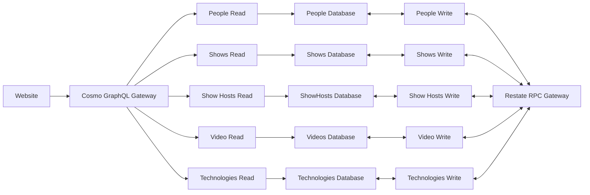

Welcome to the Rawkode Academy! We're thrilled to start talking about our new platform, designed to provide developers with an immersive and engaging learning experience.

In this article, we'll take you behind the scenes, exploring the innovative patterns and techniques we've employed to build a robust, scalable, and cloud-native platform. From CQRS and GraphQL Federation to Restate and our unique approach to service-oriented architecture, we'll delve into the key components that power our platform.

It's my job to make content that helps developers learn stuff. That stuff has varied over the last
ten years and I assume that will continue to be the case. Which appeals a lot for me, because
I like shiny things.

So when I decided to remove my dependency on YouTube and build my own platform, I decided to have
some fun.

Let me introduce you to the different patterns and techniques we've been using to build out the platform.

This article will be a little high level, but stay tuned! Over the next few weeks we'll be going deeper into each pattern and technique, with code samples.

Too impatient? Check out the [repository](https://github.com/RawkodeAcademy/RawkodeAcademy) today.

## Cloud Native

Given that I founded the Rawkode Academy to help make Cloud Native, a vast and ever changing landscape, easier for developers; it's only fitting that whatever I build for the Rawkode Academy is built as Cloud Native as it can be.

As such, the Rawkode Academy platform is built as a set of micro-services. Some are less micro and some are nano, so let's just settle on that this is a service-oriented architecture with it sometimes taking some liberties and sometimes going to extremes.

We also adopted a hybrid-cloud approach, leveraging bare metal, managed Kubernetes, and serverless.

Depending on what part of the platform you interact with; you'll be hitting either:

- **Website:** Cloudflare Pages + Workers
- **GraphQL API:** Cloud Run
- **Video Encoding:** Bare Metal on Equinix Metal
- **Auth:** GKE AutoPilot
		* We use GKE AutoPilot (with Spot) for consistently running services, such as [Zulip](https://zulip.org) and [Zitadel](https://zitadel.com).

I've taken a few liberties with the arrows on the diagram below (on the write path) in-order to have the diagram be more readable.

All write requests, and some read (such as people) go through Zitadel for AuthN.



## Command Query Responsibility Segregation (CQRS)

I've been a huge fan of the work of [Udi Dahan](https://udidahan.com/) and Greg Young for over ten years, even implementing my own CQRS & Event Sourcing libraries in a variety of languages (I actually used this as my project to learn new languages).

Event Sourcing wasn't required for the platform, but CQRS is a fantastic pattern to implement in almost any project. It allows you to separate the read and write models for your application.

In a strict CQRS fashion, these would likely actually have different views / data stores / projections; but we don't need to adopt this quite yet.

Our read API is powered by GraphQL, with federation, and our write API is powered by [Restate](https://restate.dev).

## GraphQL Federation

We use a single GraphQL Gateway, powered by [WunderGraph Cosmo](https://cosmo.wundergraph.com), which can build a query plan for your GraphQL query. This query plan is realised by individual GraphQL APIs, to the object or field level, provided by each service.

We'll be diving into this in great detail on our next article; expect it next week (December 9th, 2024).

## Restate

We use Restate as a HTTP RPC layer with built-in queues and durable execution which provides commands to write data to our, currently, shared data stores.

Currently, each service shares a data store for both reads and writes. We prioritize write optimization through our RPC commands, as read optimization is not yet a concern.

We'll dive into our RPC and Restate in a future article, but here's a quick example of how we use it.

We used Restate, with its durable execution, as writing to our platform is a complex task.

Due to the service-oriented architecture, scheduling a new live stream is a multi-part process; but we want a simple command to do so.

Imagine the following write:

```shell
curl -XPOST https://rpc.rawkode.academy/live-stream/new -d '{
	"title": "Overview of the Rawkode Academy Architecture",
	"hosts": [ "rawkode" ],
	"guests": [ "icepuma" ],
	"when": "2024-12-23Z10:00:00:Z",
	"description": "BLAH",
	"technologies": ["Restate", "Rust", "TypeScript", "GraphQL", "CQRS"]
}'
```

This is not a complete example, but to understand the complexity we need to understand this such a request is a [SAGA](https://microservices.io/patterns/data/saga.html).

We need to write multiple entities to multiple services while also ensuring referential integrity across these boundaries.

- Can we schedule a live stream for a date in the past? **No**.
- Can we schedule an episode with host `rawkode` if that identifier doesn't exist in the `people` service: **No**.
- Can we schedule an episode with guest `icepuma` if that identifier doesn't exist in the `people` service: **No**.
- Same for technologies
- and so forth

We aim to prevent write failures by implementing checks and balances. While eventual consistency is expected in a distributed system, these measures protect the integrity of the read model.

Again, stay tuned; there's lots of examples and code we can share to dive into this deeper.

---

In this article, we've explored the architecture and design choices behind the Rawkode Academy's new platform. We highlighted our commitment to a cloud-native, service-oriented approach, leveraging technologies like Cloudflare Pages, Cloud Run, Equinix Metal, and GKE AutoPilot. We also shallow dived into our implementation of CQRS, GraphQL Federation, and Restate, explaining how these patterns contribute to a robust and scalable platform.

Our use of Restate for durable execution and handling complex write operations, particularly in the context of SAGAs, ensures data integrity and consistency across our distributed services. We've also touched on the importance of eventual consistency in such an environment.

This high-level overview provides a glimpse into the underlying technologies and principles driving the Rawkode Academy platform.

Stay tuned for upcoming articles where we'll deep dive into each component with detailed explanations and code samples.

Don't want to miss the new articles?

You can choose to join the chat on our [Zulip](https://chat.rawkode.academy) server or follow our [BlueSky](https://bsky.app/profile/rawkode.academy) account to keep up to date with the platform build out and our new articles.

Until next time!
