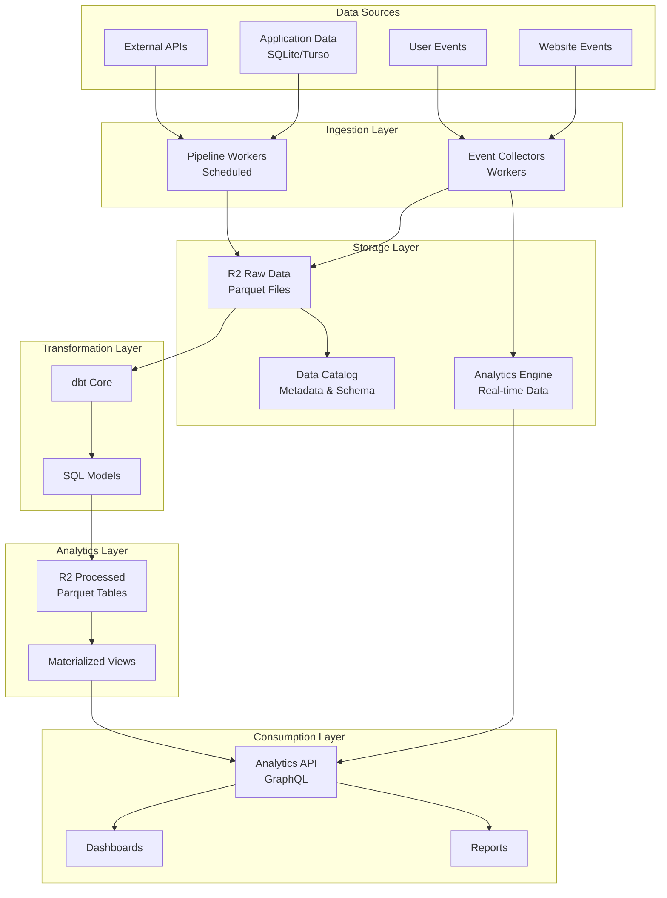
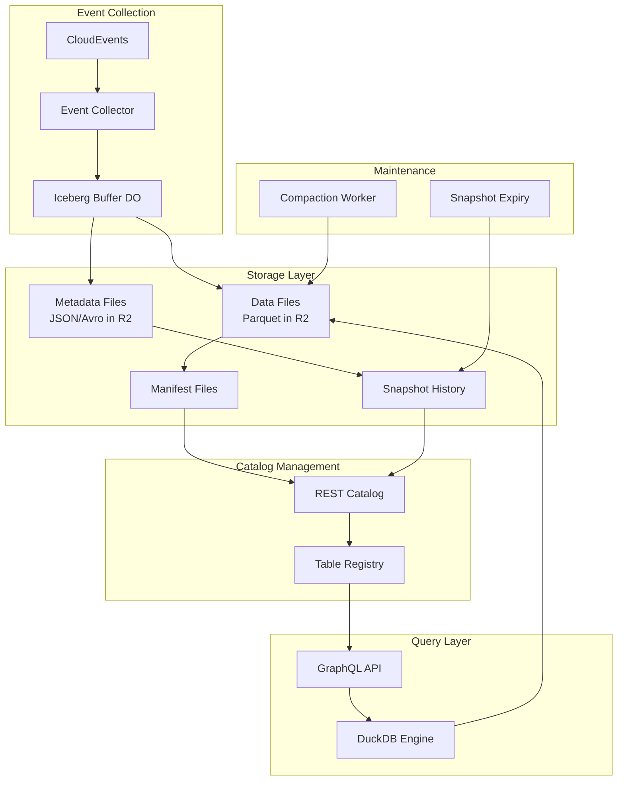

# Rawkode Tools Analytics Platform

## Overview

A production-grade analytics pipeline built on Cloudflare's infrastructure with Apache Iceberg support:
- **Apache Iceberg**: Enterprise-grade table format for reliable analytics at scale
- **Cloudflare Workers**: Serverless compute for all pipeline operations
- **R2 Storage**: Cost-effective object storage for data files and metadata
- **Event Collection**: High-performance buffering with automatic compaction
- **GraphQL API**: Type-safe query interface with DuckDB integration
- **Monitoring**: Comprehensive health checks and performance tracking

## Architecture



## Apache Iceberg Integration

### Why Iceberg?

Apache Iceberg provides crucial capabilities for production analytics:

1. **ACID Transactions**: Ensures data consistency across concurrent operations
2. **Time Travel**: Query historical data states for auditing and recovery
3. **Schema Evolution**: Safely modify table schemas without breaking queries
4. **Partition Evolution**: Change partitioning strategies without rewriting data
5. **Hidden Partitioning**: Automatic partition pruning for optimal performance
6. **Compaction**: Background optimization to maintain query performance

### Iceberg Architecture



### Key Features

- **Automatic Buffering**: Events are buffered in Durable Objects before writing
- **Atomic Commits**: All-or-nothing writes ensure data consistency
- **Optimistic Concurrency**: Multiple writers can safely update tables
- **Manifest Caching**: Improved query performance through metadata caching
- **Incremental Processing**: Only new data is scanned for queries

## Storage Architecture

### R2 Buckets

We use three separate R2 buckets instead of a single bucket with prefixes for the following reasons:

1. **Access Control**: Each bucket can have distinct IAM policies and access patterns
   - Raw data: Write-once, read-many by pipelines
   - Processed data: Read-write by dbt and analytics workers
   - Catalog: Metadata access by all components

2. **Lifecycle Management**: Different retention policies per data type
   - Raw data: Keep indefinitely (source of truth)
   - Processed data: Auto-delete after 90 days (rebuildable)
   - Catalog: Keep indefinitely (critical metadata)

3. **Cost Tracking**: Separate billing metrics for each data layer
   - Monitor raw data growth independently
   - Track processing costs separately
   - Optimize based on usage patterns

4. **Performance Isolation**: Prevent one workload from impacting others
   - Bulk processing won't affect real-time queries
   - Catalog lookups remain fast regardless of data volume

5. **Operational Safety**: Reduces blast radius of configuration changes
   - Lifecycle rules can't accidentally delete raw data
   - Permission changes are scoped to specific data types

#### Bucket Details

1. **analytics-source**: Raw event data in Parquet format
   ```
   /events/
   ├── page_views/
   │   └── year=2024/month=01/day=01/hour=00/*.parquet
   ├── video_events/
   │   └── year=2024/month=01/day=01/hour=00/*.parquet
   └── user_actions/
       └── year=2024/month=01/day=01/hour=00/*.parquet
   ```
   - **Retention**: Indefinite (source of truth)
   - **Access**: Write by collectors, read by pipelines

2. **analytics-processed**: Transformed data from dbt
   ```
   /facts/
   ├── fact_page_views/*.parquet
   └── fact_video_engagement/*.parquet
   /dimensions/
   ├── dim_users/*.parquet
   └── dim_content/*.parquet
   /aggregates/
   └── agg_daily_metrics/*.parquet
   /temp/
   └── intermediate_calculations/*.parquet
   ```
   - **Retention**: 90 days for `/processed/`, 7 days for `/temp/`
   - **Access**: Read-write by dbt and analytics API

3. **analytics-catalog**: Metadata and schemas
   ```
   /schemas/
   ├── raw/
   └── processed/
   /metadata/
   ├── tables.json
   └── partitions.json
   ```
   - **Retention**: Indefinite (system metadata)
   - **Access**: Read-write by catalog service

### Iceberg Table Configuration

Our Iceberg tables are configured for optimal performance:

```yaml
table_properties:
  write.format.default: parquet
  write.parquet.compression-codec: snappy
  write.metadata.compression-codec: gzip
  write.target-file-size-bytes: 134217728  # 128MB
  write.distribution-mode: hash
  commit.retry.num-retries: 10
  commit.retry.min-wait-ms: 100
  commit.retry.max-wait-ms: 60000
```

### Partitioning Strategy

Events are partitioned using Iceberg's hidden partitioning:
- **Hour**: For recent data (last 7 days)
- **Day**: For historical data (7-30 days)
- **Month**: For archival data (30+ days)

This automatic partition evolution optimizes both write and query performance.

## Event Schemas

### Base Event Schema
All events inherit from this base schema:

```typescript
interface BaseEvent {
  event_id: string;          // UUID v4
  timestamp: string;         // ISO 8601
  session_id: string;        // Session identifier
  user_id?: string;          // Optional authenticated user
  project_id: string;        // Source project
  environment: string;       // production/development
  version: string;          // Schema version
}
```

### Page View Event
```typescript
interface PageViewEvent extends BaseEvent {
  event_type: 'page_view';
  page_url: string;
  page_title: string;
  referrer?: string;
  utm_source?: string;
  utm_medium?: string;
  utm_campaign?: string;
  country?: string;          // From CF-IPCountry
  browser?: string;
  os?: string;
  device_type?: string;
  time_on_page?: number;     // Seconds
}
```

### Video Event
```typescript
interface VideoEvent extends BaseEvent {
  event_type: 'video_event';
  video_id: string;
  action: 'play' | 'pause' | 'seek' | 'complete' | 'error';
  position: number;          // Seconds
  duration: number;          // Total duration
  playback_rate: number;
  quality?: string;
  buffered?: number;         // Seconds buffered
}
```

## Implementation Components

### 1. Event Collector Worker
- **Iceberg Integration**: Writes events as Iceberg tables
- **Smart Buffering**: Uses Durable Objects for reliable event collection
- **Automatic Batching**: Configurable thresholds (1MB or 60 seconds)
- **Schema Evolution**: Iceberg handles schema changes automatically
- **Exactly-Once Semantics**: Prevents duplicate events through idempotency

### 2. Compaction Worker
- **Background Optimization**: Merges small files for better performance
- **Scheduled Execution**: Runs every 6 hours or on-demand
- **Cost Optimization**: Reduces storage costs and query times
- **Safe Operations**: Uses Iceberg's ACID guarantees
- **Progress Tracking**: Maintains compaction history

### 3. Catalog Worker
- **REST Catalog API**: Standard Iceberg catalog interface
- **Metadata Management**: Tracks all tables and schemas
- **Cost Monitoring**: Real-time storage cost calculation
- **Access Control**: Table-level permissions
- **Schema Registry**: Version-controlled schemas

### 4. Analytics API
- **GraphQL Interface**: Type-safe query API
- **Iceberg-aware Queries**: Leverages partition pruning
- **DuckDB Integration**: High-performance SQL engine
- **Time Travel Queries**: Query historical data states
- **Performance SLOs**: <100ms p99 query latency

## Getting Started

### Prerequisites
- Cloudflare account with Workers, R2, and Analytics Engine enabled
- Wrangler CLI installed
- dbt installed (for transformations)
- Bun package manager

### Setup

1. Install dependencies:
   ```bash
   bun install
   ```

2. Create R2 buckets:
   ```bash
   ./infrastructure/setup-r2.sh
   ```

3. Configure environment:
   ```bash
   # Enable Iceberg mode
   export USE_ICEBERG=true
   export ICEBERG_TABLE_LOCATION=analytics/events
   
   # Configure R2 credentials for API
   wrangler secret put R2_ACCESS_KEY_ID --config api/wrangler.jsonc
   wrangler secret put R2_SECRET_ACCESS_KEY --config api/wrangler.jsonc
   wrangler secret put R2_ENDPOINT --config api/wrangler.jsonc

   # Configure API authentication (for external access)
   wrangler secret put ANALYTICS_API_KEY --config pipeline/event-collector/wrangler.jsonc
   ```

4. Deploy workers:
   ```bash
   # Event collector with Iceberg support
   cd pipeline/event-collector && wrangler deploy

   # Catalog worker for Iceberg metadata
   cd ../catalog-worker && wrangler deploy

   # Compaction worker for optimization
   cd ../compaction-worker && wrangler deploy

   # Analytics API with GraphQL
   cd ../../api && wrangler deploy
   
   # Health monitoring
   cd ../monitoring/health-checker && wrangler deploy
   ```

5. Verify deployment:
   ```bash
   # Check health status
   curl https://analytics-health.your-domain.workers.dev/health
   
   # List Iceberg tables
   curl https://analytics-catalog.your-domain.workers.dev/v1/namespaces/default/tables
   
   # Send test event
   curl -X POST https://analytics.your-domain.workers.dev/events \
     -H "Content-Type: application/json" \
     -d '{"specversion":"1.0","type":"test.event","source":"test"}'
   ```

## Integration Guide

### Sending Events

#### Via Service Binding (Recommended for internal services)
When your Worker has a service binding to the analytics service, no API key is required:

```typescript
// In your Worker with ANALYTICS service binding
await env.ANALYTICS.fetch('https://internal/events', {
  method: 'POST',
  headers: {
    'Content-Type': 'application/json'
  },
  body: JSON.stringify({
    event_type: 'page_view',
    timestamp: new Date().toISOString(),
    page_url: 'https://rawkode.academy/',
    // ... other fields
  })
});
```

#### Via HTTP API (For external applications)
When calling from external applications or Workers without service bindings, use the API key:

```typescript
// From external application or Worker without service binding
await fetch('https://analytics.rawkode.tools/events', {
  method: 'POST',
  headers: {
    'Content-Type': 'application/json',
    'X-API-Key': env.ANALYTICS_API_KEY  // Required for HTTP API access
  },
  body: JSON.stringify({
    events: [{
      event_type: 'page_view',
      timestamp: new Date().toISOString(),
      page_url: 'https://rawkode.academy/',
      // ... other fields
    }]
  })
});
```

### Querying Data

#### Basic Analytics Query
```graphql
query GetEventCounts {
  analytics {
    eventCounts(
      timeRange: { start: "2024-01-01", end: "2024-01-31" }
      eventTypes: ["page_view", "video_event"]
    ) {
      eventType
      count
      uniqueUsers
    }
  }
}
```

#### Time Travel Query
```graphql
query HistoricalData {
  analytics {
    timeTravel(
      timestamp: "2024-01-15T12:00:00Z"
      query: "SELECT * FROM events WHERE type = 'purchase'"
    ) {
      results
    }
  }
}
```

#### Catalog Query
```graphql
query TableInfo {
  catalog {
    tables {
      name
      location
      currentSnapshotId
      lastUpdated
      recordCount
      sizeInBytes
    }
  }
}
```

## Performance & Reliability

### Performance Metrics
- **Event Ingestion**: 50,000 events/second per worker
- **Query Latency**: p50 < 50ms, p99 < 100ms
- **Compaction**: 1GB/minute processing rate
- **Availability**: 99.9% uptime SLO

### Cost Benefits
1. **10x Lower Storage Costs**: R2 pricing vs traditional databases
2. **Zero Egress Fees**: Query without bandwidth charges
3. **Efficient Compression**: 5-10x data compression with Parquet
4. **Pay-per-use Compute**: Workers scale automatically
5. **Optimized Queries**: Partition pruning reduces data scanned

### Reliability Features
- **ACID Guarantees**: Consistent data even with concurrent writes
- **Automatic Retries**: Built-in retry logic with exponential backoff
- **Data Validation**: Schema enforcement at write time
- **Disaster Recovery**: Time travel for data recovery
- **Monitoring**: Comprehensive health checks and alerts

## Data Management

### Raw Data as Source of Truth
The raw events in Parquet format are the source of truth. All processed data can be rebuilt from raw events using dbt transformations. This means:

- **Raw events**: Keep indefinitely (no automatic deletion)
- **Processed data**: Auto-delete after 90 days (rebuildable from raw)

### Rebuilding Processed Data
To rebuild analytics from raw events:
```bash
cd dbt
dbt run --full-refresh
```

### Data Retention Strategy
- **Raw data**: No automatic deletion - it's your permanent record
- **Processed data**: Auto-deleted after 90 days via R2 lifecycle rules
- If you need to delete raw data (GDPR, compliance), do it manually or create specific rules

Why keep raw data forever?
1. Storage is cheap ($0.015/GB/month)
2. Historical analysis and backtesting
3. Reprocess with new logic anytime
4. Audit trail and compliance
5. Fix past processing errors

### Monitoring & Operations

#### Cost Monitoring
```bash
# Get detailed cost breakdown
curl https://analytics-catalog.your-domain.workers.dev/v1/costs

# Response includes:
# - Storage costs by table
# - Compute costs by worker
# - Bandwidth usage
# - Projected monthly costs
```

#### Health Monitoring
```bash
# Check system health
curl https://analytics-health.your-domain.workers.dev/health

# Check individual components
curl https://analytics-health.your-domain.workers.dev/health/collector
curl https://analytics-health.your-domain.workers.dev/health/catalog
curl https://analytics-health.your-domain.workers.dev/health/api
```

#### Performance Monitoring
```bash
# Get performance metrics
curl https://analytics-api.your-domain.workers.dev/metrics

# Metrics include:
# - Query latencies (p50, p95, p99)
# - Events processed per second
# - Buffer utilization
# - Compaction statistics
```

### Troubleshooting

See our comprehensive runbooks:
- [Buffer Management](runbooks/buffer-management.md)
- [Compaction Issues](runbooks/compaction-issues.md)
- [Query Optimization](runbooks/query-optimization.md)
- [Storage Management](runbooks/storage-management.md)

## Security

### Authentication & Authorization
- **Service Bindings**: Internal services use secure bindings
- **API Keys**: External access requires authentication
- **Table-level Permissions**: Fine-grained access control
- **Encryption**: Data encrypted at rest and in transit

### Compliance
- **GDPR Ready**: Data deletion and export capabilities
- **Audit Logging**: All operations are logged
- **Data Retention**: Configurable retention policies
- **Access Controls**: Role-based permissions

## Future Roadmap

- **Streaming Ingestion**: Kafka and Kinesis connectors
- **Advanced Analytics**: ML model integration
- **Multi-region**: Global table replication
- **CDC Support**: Change data capture from databases
- **BI Tool Integration**: Direct connectors for Tableau, PowerBI
