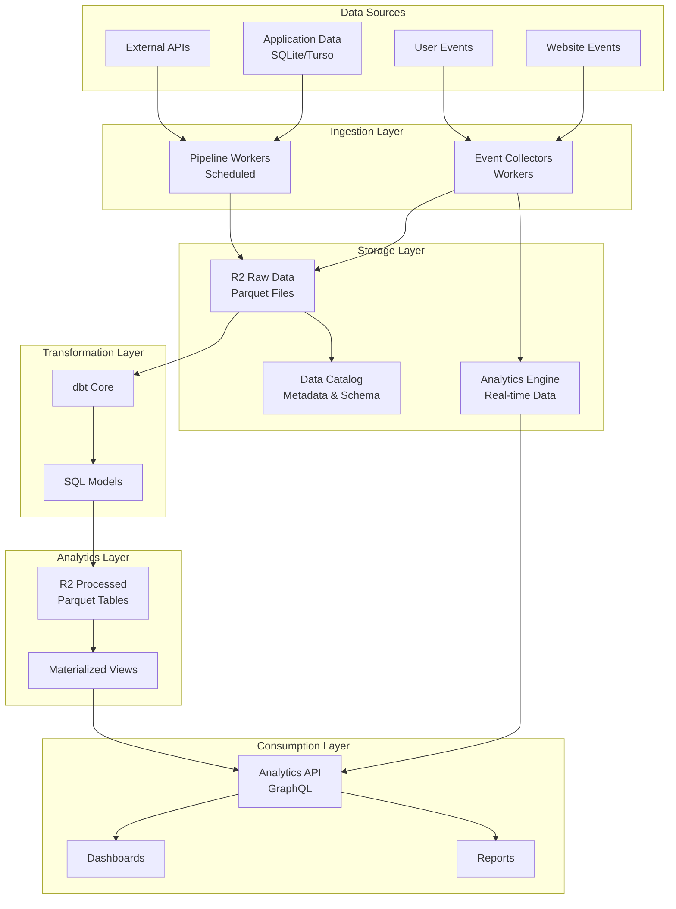

# Rawkode Tools Analytics Platform

## Overview

A production-grade analytics pipeline built on Cloudflare's infrastructure:
- **Cloudflare Pipelines**: Orchestrates data flow and transformations
- **R2 + Data Catalog**: Data lake with Parquet files and managed metadata
- **dbt**: SQL-based data transformations and modeling
- **Analytics Engine**: Real-time query capabilities
- **Cloudflare Workers**: Serverless compute for all pipeline operations

## Architecture



## Storage Architecture

### R2 Buckets

We use three separate R2 buckets instead of a single bucket with prefixes for the following reasons:

1. **Access Control**: Each bucket can have distinct IAM policies and access patterns
   - Raw data: Write-once, read-many by pipelines
   - Processed data: Read-write by dbt and analytics workers
   - Catalog: Metadata access by all components

2. **Lifecycle Management**: Different retention policies per data type
   - Raw data: Keep indefinitely (source of truth)
   - Processed data: Auto-delete after 90 days (rebuildable)
   - Catalog: Keep indefinitely (critical metadata)

3. **Cost Tracking**: Separate billing metrics for each data layer
   - Monitor raw data growth independently
   - Track processing costs separately
   - Optimize based on usage patterns

4. **Performance Isolation**: Prevent one workload from impacting others
   - Bulk processing won't affect real-time queries
   - Catalog lookups remain fast regardless of data volume

5. **Operational Safety**: Reduces blast radius of configuration changes
   - Lifecycle rules can't accidentally delete raw data
   - Permission changes are scoped to specific data types

#### Bucket Details

1. **analytics-source**: Raw event data in Parquet format
   ```
   /events/
   ├── page_views/
   │   └── year=2024/month=01/day=01/hour=00/*.parquet
   ├── video_events/
   │   └── year=2024/month=01/day=01/hour=00/*.parquet
   └── user_actions/
       └── year=2024/month=01/day=01/hour=00/*.parquet
   ```
   - **Retention**: Indefinite (source of truth)
   - **Access**: Write by collectors, read by pipelines

2. **analytics-processed**: Transformed data from dbt
   ```
   /facts/
   ├── fact_page_views/*.parquet
   └── fact_video_engagement/*.parquet
   /dimensions/
   ├── dim_users/*.parquet
   └── dim_content/*.parquet
   /aggregates/
   └── agg_daily_metrics/*.parquet
   /temp/
   └── intermediate_calculations/*.parquet
   ```
   - **Retention**: 90 days for `/processed/`, 7 days for `/temp/`
   - **Access**: Read-write by dbt and analytics API

3. **analytics-catalog**: Metadata and schemas
   ```
   /schemas/
   ├── raw/
   └── processed/
   /metadata/
   ├── tables.json
   └── partitions.json
   ```
   - **Retention**: Indefinite (system metadata)
   - **Access**: Read-write by catalog service

## Event Schemas

### Base Event Schema
All events inherit from this base schema:

```typescript
interface BaseEvent {
  event_id: string;          // UUID v4
  timestamp: string;         // ISO 8601
  session_id: string;        // Session identifier
  user_id?: string;          // Optional authenticated user
  project_id: string;        // Source project
  environment: string;       // production/development
  version: string;          // Schema version
}
```

### Page View Event
```typescript
interface PageViewEvent extends BaseEvent {
  event_type: 'page_view';
  page_url: string;
  page_title: string;
  referrer?: string;
  utm_source?: string;
  utm_medium?: string;
  utm_campaign?: string;
  country?: string;          // From CF-IPCountry
  browser?: string;
  os?: string;
  device_type?: string;
  time_on_page?: number;     // Seconds
}
```

### Video Event
```typescript
interface VideoEvent extends BaseEvent {
  event_type: 'video_event';
  video_id: string;
  action: 'play' | 'pause' | 'seek' | 'complete' | 'error';
  position: number;          // Seconds
  duration: number;          // Total duration
  playback_rate: number;
  quality?: string;
  buffered?: number;         // Seconds buffered
}
```

## Implementation Components

### 1. Event Collector Worker
- Buffers events in memory
- Writes to Parquet in batches (configurable size/time)
- Handles schema evolution
- Partitions by time

### 2. Pipeline Workers
- Extract data from various sources
- Transform to standard schemas
- Write to R2 in Parquet format
- Update Data Catalog

### 3. dbt Project
- Staging models for raw data
- Intermediate transformations
- Final analytics models
- Data quality tests

### 4. Analytics API
- GraphQL endpoint for queries
- Direct Parquet queries via DuckDB WASM
- Caching layer for performance
- Access control integration

## Getting Started

### Prerequisites
- Cloudflare account with Workers, R2, and Analytics Engine enabled
- Wrangler CLI installed
- dbt installed (for transformations)
- Bun package manager

### Setup

1. Install dependencies:
   ```bash
   bun install
   ```

2. Create R2 buckets:
   ```bash
   ./infrastructure/setup-r2.sh
   ```

3. Configure secrets:
   ```bash
   # For the API worker (if using DuckDB queries)
   wrangler secret put R2_ACCESS_KEY_ID --config wrangler-api.toml
   wrangler secret put R2_SECRET_ACCESS_KEY --config wrangler-api.toml
   wrangler secret put R2_ENDPOINT --config wrangler-api.toml

   # For the event collector (only needed for external HTTP API access)
   # Note: The website uses service bindings which don't require an API key
   wrangler secret put ANALYTICS_API_KEY --config pipeline/event-collector/wrangler.jsonc
   ```

4. Deploy workers:
   ```bash
   # Event collector
   wrangler deploy

   # Catalog worker
   wrangler deploy --config wrangler-catalog.toml

   # Compaction worker
   wrangler deploy --config wrangler-compaction.toml

   # Analytics API
   wrangler deploy --config wrangler-api.toml
   ```

5. Initialize dbt (for transformations):
   ```bash
   cd dbt
   export R2_ACCESS_KEY_ID=your_key
   export R2_SECRET_ACCESS_KEY=your_secret
   dbt deps
   ```

## Integration Guide

### Sending Events

#### Via Service Binding (Recommended for internal services)
When your Worker has a service binding to the analytics service, no API key is required:

```typescript
// In your Worker with ANALYTICS service binding
await env.ANALYTICS.fetch('https://internal/events', {
  method: 'POST',
  headers: {
    'Content-Type': 'application/json'
  },
  body: JSON.stringify({
    event_type: 'page_view',
    timestamp: new Date().toISOString(),
    page_url: 'https://rawkode.academy/',
    // ... other fields
  })
});
```

#### Via HTTP API (For external applications)
When calling from external applications or Workers without service bindings, use the API key:

```typescript
// From external application or Worker without service binding
await fetch('https://analytics.rawkode.tools/events', {
  method: 'POST',
  headers: {
    'Content-Type': 'application/json',
    'X-API-Key': env.ANALYTICS_API_KEY  // Required for HTTP API access
  },
  body: JSON.stringify({
    events: [{
      event_type: 'page_view',
      timestamp: new Date().toISOString(),
      page_url: 'https://rawkode.academy/',
      // ... other fields
    }]
  })
});
```

### Querying Data
```graphql
query GetPageViews {
  analytics {
    pageViews(
      timeRange: { start: "2024-01-01", end: "2024-01-31" }
      groupBy: ["page_url"]
    ) {
      page_url
      view_count
      unique_users
      avg_time_on_page
    }
  }
}
```

## Benefits

1. **Cost Effective**: R2 storage is 10x cheaper than traditional databases
2. **Scalable**: Handles millions of events with ease
3. **Flexible**: Schema evolution without downtime
4. **Fast**: Columnar format optimized for analytics
5. **Standard**: Uses industry-standard formats (Parquet, SQL)

## Data Management

### Raw Data as Source of Truth
The raw events in Parquet format are the source of truth. All processed data can be rebuilt from raw events using dbt transformations. This means:

- **Raw events**: Keep indefinitely (no automatic deletion)
- **Processed data**: Auto-delete after 90 days (rebuildable from raw)

### Rebuilding Processed Data
To rebuild analytics from raw events:
```bash
cd dbt
dbt run --full-refresh
```

### Data Retention Strategy
- **Raw data**: No automatic deletion - it's your permanent record
- **Processed data**: Auto-deleted after 90 days via R2 lifecycle rules
- If you need to delete raw data (GDPR, compliance), do it manually or create specific rules

Why keep raw data forever?
1. Storage is cheap ($0.015/GB/month)
2. Historical analysis and backtesting
3. Reprocess with new logic anytime
4. Audit trail and compliance
5. Fix past processing errors

### Cost Monitoring
Check storage usage via the catalog API:
```bash
curl https://your-catalog-worker.workers.dev/catalog/costs
```
